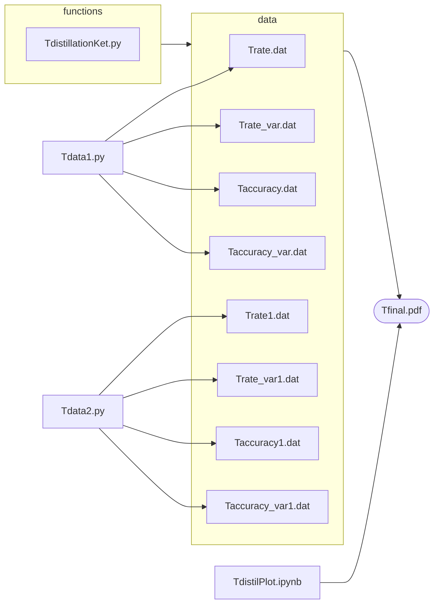

# error_msd
Error simulation of magic state distillation.

# Figure of T-distillation simulation

```mermaid
flowchart LR;
    subgraph data
        E[Trate.dat]
        F[Trate_var.dat]
        G[Taccuracy.dat]
        H[Taccuracy_var.dat]
        I[Trate1.dat]
        J[Trate_var1.dat]
        K[Taccuracy1.dat]
        L[Taccuracy_var1.dat]
    end
    subgraph functions
        M[TdistillationKet.py]
    end
    A[TdistilPlot.ipynb]-->B([Tfinal.pdf]);
    C[Tdata1.py]-->E
    C-->F
    C-->G
    C-->H
    D[Tdata2.py]-->I
    D-->J
    D-->K
    D-->L
    data-->B
    functions-->data
```